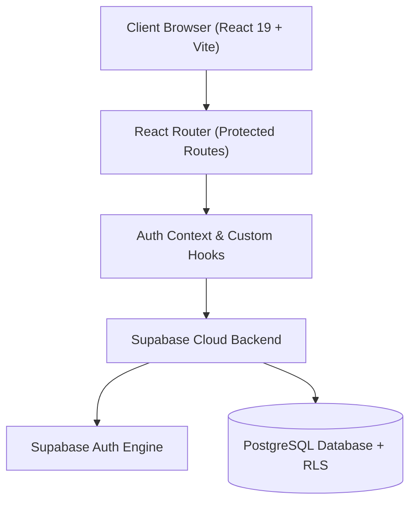
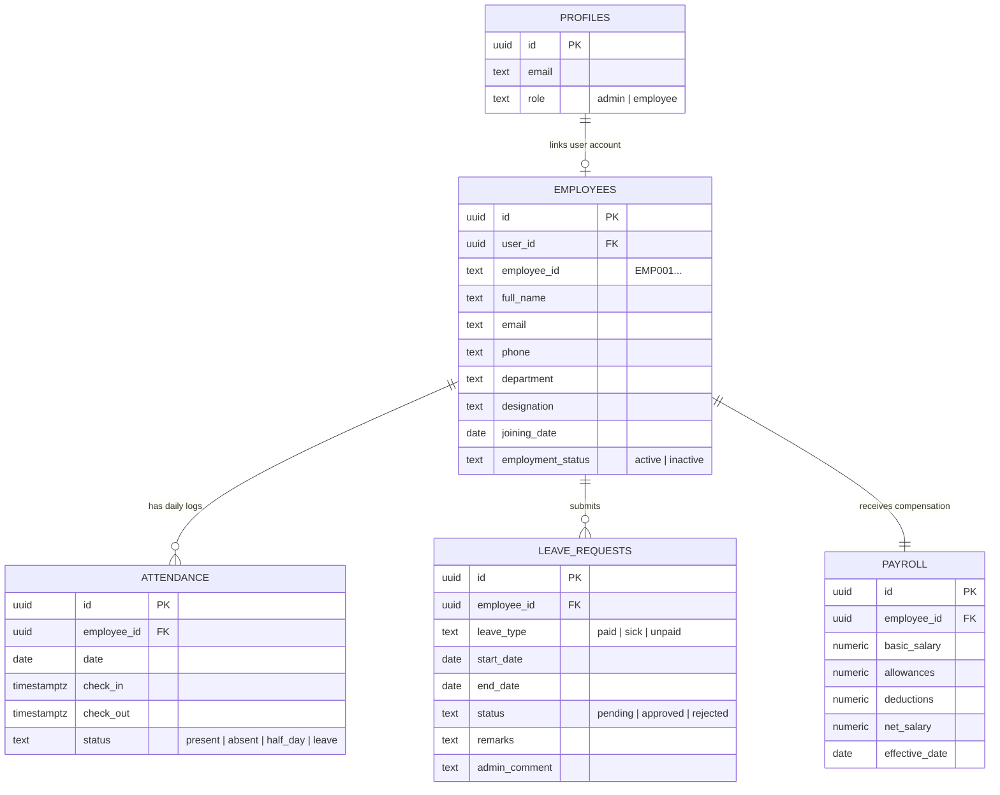

# 🌊 Dayflow HRMS — Modern Workforce & Human Resource Management System

[](https://hr-dayflow.vercel.app)
[](https://react.dev/)
[](https://www.typescriptlang.org/)
[](https://vitejs.dev/)
[](https://supabase.com/)
[](https://tailwindcss.com/)

> **Dayflow** is an enterprise-grade, cloud-native Human Resource Management System (HRMS) uniting **HR Administration** and **Employee Self-Service** into a real-time platform with automated payroll, attendance tracking, leave workflows, and role-based security.

---

## 🚀 Live Demo & Deployment

- 🌐 **Production URL**: [https://hr-dayflow.vercel.app](https://hr-dayflow.vercel.app)
- 🔑 **Admin Portal**: [https://hr-dayflow.vercel.app/admin/dashboard](https://hr-dayflow.vercel.app/admin/dashboard)
- 👤 **Employee Portal**: [https://hr-dayflow.vercel.app/employee/dashboard](https://hr-dayflow.vercel.app/employee/dashboard)

### 🧪 Pre-configured Demo Accounts:
| Role | Email | Password | Access Scope |
| :--- | :--- | :--- | :--- |
| **HR Administrator** | `priya.sharma@dayflow.io` | `admin123` | Full HR operations, employee roster, leave approvals, payroll controls |
| **Staff Employee** | `arjun.reddy@dayflow.io` | `admin123` | Personal profile, clock-in/out, leave applications, personal payslips |

*(You can also use the **"Fill Demo Admin"** / **"Fill Demo Employee"** 1-click shortcut buttons on the login screen).*

---

## ✨ Key Features

### 🏢 1. HR & Admin Portal
- **Executive Analytics Dashboard**: Real-time company KPIs, attendance trends, active headcounts, and pending review alerts.
- **Employee Directory & File Management**: Comprehensive employee registry with filtering by department, designation, and status; includes modal profile editing.
- **Company-Wide Attendance Matrix**: Real-time log of daily clock-ins, check-outs, work durations, half-days, and absences.
- **Leave Request Management**: Two-way workflow allowing HR to review, approve, or reject employee time-off applications with custom administrative feedback.
- **Dynamic Payroll Structure**: Manage base salary, allowances, and statutory deductions with PostgreSQL triggers calculating net take-home pay in real time.

### 👤 2. Employee Self-Service Portal
- **Personalized Dashboard**: Dynamic greeting, personal attendance metrics, leave balance tracker, and recent activity feed.
- **One-Click Check-In Widget**: Daily clock-in and clock-out with immediate timestamp recording.
- **My Profile & Two-Way Sync**: View employment details and edit contact information (phone, residential address) which immediately synchronizes with HR records.
- **Leave Applications**: Dynamic leave balances (Annual, Medical, Unpaid) with instant application submission directly to HR.
- **Payslip & Compensation View**: Breakdown of gross earnings, PF/tax deductions, and printable payslips.

---

## 🛠️ Architecture & Tech Stack



- **Frontend Core**: React 19, TypeScript, Vite
- **Styling & UI**: Tailwind CSS, Lucide React icons, Framer Motion
- **Form Management**: React Hook Form, Zod Schema Validation
- **Charts & Data Visualization**: Recharts
- **Database & Backend**: Supabase (PostgreSQL, Row Level Security, Automated Calculation Triggers, Auth)
- **Deployment & Hosting**: Vercel Global Edge Network with client-side SPA routing

---

## 🗄️ Database Schema Overview



---

## 💻 Local Development Setup

### 1. Clone the Repository
```bash
git clone https://github.com/pranav16121/hr_dayflow.git
cd hr_dayflow
```

### 2. Install Dependencies
```bash
npm install
```

### 3. Configure Environment Variables
Create a `.env` file in the project root:
```env
VITE_SUPABASE_URL=https://your-project.supabase.co
VITE_SUPABASE_PUBLISHABLE_KEY=your-supabase-anon-key
```

### 4. Run Development Server
```bash
npm run dev
```
Open **[http://localhost:5173](http://localhost:5173)** or **[http://localhost:5174](http://localhost:5174)** in your browser.

### 5. Build & Lint Verification
```bash
# Verify TypeScript and create production bundle
npm run build

# Run Oxlint
npm run lint
```

---

## 🔒 Security & Best Practices
- **Row Level Security (RLS)**: Enforced on all tables (`employees`, `attendance`, `leave_requests`, `payroll`, `profiles`).
- **No Client Secrets**: Only the Supabase publishable anon key is exposed to the frontend; service role keys are strictly server-side and gitignored.
- **Strict TypeScript**: Verified with `tsc -b` and zero type coercion errors.

---

## 📄 License
This project is licensed under the **MIT License**.
